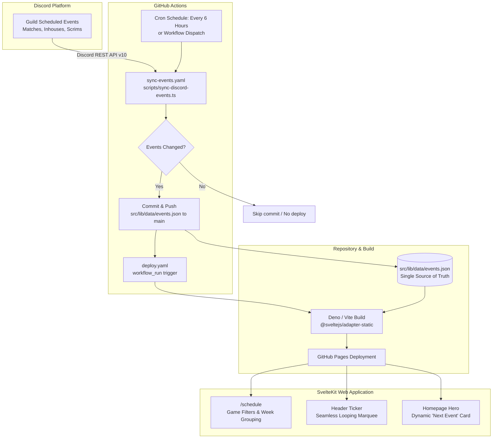

# Discord Events Sync & Schedule Pipeline Architecture

## 1. Executive Summary

This document describes the automated event ingestion and rendering pipeline for the **Esports at Oregon State University** website (`eaosu.github.io`). The system automates fetching official matches, club inhouses, and community events directly from the EAOSU Discord server using **GitHub Actions**, transforms and expands recurring events into structured JSON, and statically generates a reactive schedule page, dynamic ticker, and homepage highlights via **SvelteKit** hosted on **GitHub Pages**.

---

## 2. High-Level Architecture & Data Flow



---

## 3. Core Subsystems

### 3.1. Discord Event Ingestion Engine (`scripts/sync-discord-events.ts`)

The ingestion script is a zero-dependency script designed to run natively on both **Node.js (v18+)** and **Deno (v2.x)** using standard `node:` modules (`node:fs/promises`, `node:process`) and web standard `fetch` and `Intl`.

#### Responsibilities:
1. **API Ingestion**:
   - Queries `GET https://discord.com/api/v10/guilds/${DISCORD_GUILD_ID}/scheduled-events?with_user_count=true`.
   - Normalizes authorization headers (`Bot <token>`), gracefully handling tokens copied with or without the `Bot ` prefix and trimming whitespace.
2. **Game Categorization (Keyword Matching)**:
   - Matches title and description against regex patterns for club titles:
     - **Overwatch (`ow`)**: `/\b(overwatch|ow|ow2)\b/i`
     - **Valorant (`val`)**: `/\b(valorant|val|cval)\b/i`
     - **League of Legends (`lol`)**: `/\b(league(\s+of\s+legends)?|lol|tft|teamfight\s+tactics)\b/i`
     - **Rocket League (`rl`)**: `/\b(rocket\s+league|crl|rl)\b/i`
     - **Rainbow Six Siege (`r6`)**: `/\b(rainbow\s+six(\s+siege)?|r6|siege)\b/i`
     - **Dead by Daylight (`dbd`)**: `/\b(dead\s+by\s+daylight|dbd)\b/i`
     - **Counter-Strike 2 (`cs`)**: `/\b(counter[\s-]?strike(\s*2)?|cs2|csgo|cs:go)\b/i`
     - **Deadlock (`dlk`)**: `/\b(deadlock|dlk)\b/i`
     - **Marvel Rivals (`mr`)**: `/\b(marvel\s+rivals|rivals)\b/i` (safeguarded against single "Mr." false matches)
     - **Community (`comm`)**: Fallback for non-title specific events.
3. **Format Detection (Community vs. Competitive)**:
   - Evaluates whether an event is a club/community event (e.g. inhouses, casual scrims, watch parties, game nights) or an official collegiate match, driving CSS presentation (`.match.community` vs `.match`).
4. **Timezone & Date Normalization**:
   - Standardizes all timestamps to Corvallis local time (`America/Los_Angeles`), outputting human-readable date parts (`dateDay: "Wed 10"`, `dateMonth: "October"`, `timeFormatted: "7:00 PM"`, and `tickerDay: "WED 10/10"`).
   - Groups events by Monday-anchored weeks (`formatWeekLabel`).
5. **Recurrence Expansion Engine**:
   - Discord's API only returns the *single immediate next occurrence* of a recurring event alongside a `recurrence_rule` metadata object.
   - `expandEventOccurrences()` projects recurring events **up to 35 days (5 weeks) into the future** (up to 5 occurrences per series).
   - **Daylight Saving Time (DST) Resilience**: Date shifts are calculated on local calendar components rather than raw milliseconds, ensuring a 7:00 PM event remains at 7:00 PM Pacific Time across November/March DST transitions.
   - **Cancellation Exceptions**: Inspects `guild_scheduled_event_exceptions` to omit any occurrences explicitly canceled (`is_canceled: true`) in Discord.
6. **Change Detection & Zero Churn**:
   - Compares candidate output against existing file contents. If event IDs, timestamps, and metadata have not changed, the file is not written. This prevents automated commit churn every 6 hours and saves GitHub Actions build minutes.
7. **Offline Safety**:
   - If secrets are absent or the Discord API is unreachable, existing data is preserved without failing the script or build.

---

### 3.2. Data Schema (`src/lib/data/events.json`)

The single source of truth committed to Git:

```typescript
interface ProcessedEvent {
  id: string;             // Discord snowflake or `${snowflake}_occ${index}`
  name: string;           // Event title (e.g., "Deadlock Inhouses")
  description: string;    // Sanitized description or notes
  gameCode: string;       // e.g., "dlk", "val", "ow", "comm"
  gameName: string;       // Display game name
  isCommunity: boolean;   // True for inhouses/club socials; false for collegiate matches
  location: string;       // Resolved Discord channel or external venue
  startTime: string;      // ISO 8601 timestamp
  endTime: string | null; // ISO 8601 timestamp
  dateDay: string;        // e.g. "Wed 30"
  dateMonth: string;      // e.g. "Sep"
  timeFormatted: string;  // e.g. "7:00 PM"
  weekLabel: string;      // e.g. "Week of September 28"
  tickerText: string;     // e.g. "WED 9/30 — Deadlock Inhouses — 7:00 PM"
  discordUrl: string;     // Direct link: "https://discord.com/events/<guildId>/<eventId>"
}

interface OutputData {
  lastUpdated: string;
  events: ProcessedEvent[];
}
```

---

### 3.3. GitHub Actions CI/CD Pipeline

#### 1. Event Synchronizer (`.github/workflows/sync-events.yaml`)
* **Triggers**:
  - `schedule`: Runs at `00:00`, `06:00`, `12:00`, `18:00` UTC daily.
  - `workflow_dispatch`: Manual trigger via GitHub UI.
* **Permissions**: `contents: write` (to push commits).
* **Execution**: Runs `scripts/sync-discord-events.ts` under Deno v2.
* **Auto-Commit**:
  - Runs `git diff --staged --quiet` on `src/lib/data/events.json`.
  - If modified, commits via `github-actions[bot]` with rebase protection (`git pull --rebase origin main`) and pushes to `main`.

#### 2. Pages Deployment (`.github/workflows/deploy.yaml`)
* **Triggers**:
  - `push` to `main`.
  - `workflow_run`: Chained automatically to run whenever `Sync Discord Events` finishes on `main`.
  - `workflow_dispatch`: Manual rebuilds.
* **Condition**:
  `if: ${{ github.event_name != 'workflow_run' || github.event.workflow_run.conclusion == 'success' }}`
  Ensures broken sync attempts do not trigger deployments.

---

### 3.4. Frontend Presentation Layer

#### Schedule Page (`src/routes/schedule/+page.svelte`)
* **Svelte 5 Runes**:
  - Replaced legacy imperative DOM querying (`querySelectorAll`, `dataset`) with reactive state: `activeFilter = $state('all')` and `$derived.by(...)`.
  - Groups filtered events into weekly segments (`weekLabel`) preserving chronological order.
* **Zero-Error Filtering**: Eliminates type assertion errors and provides instant client-side filtering across all games.
* **Empty State**: Displays an aesthetic fallback banner with a Discord invite button when a filtered category has no active events.

#### Header Marquee Ticker (`src/components/Ticker.svelte`)
* **Dynamic Loading**: Loads active events from `events.json`.
* **Track Length Guard**: `buildTickerItems()` ensures short event lists (e.g. 1 or 2 items) are looped to at least 8–12 items, preventing visual breaks/gaps during CSS keyframe scroll on ultrawide and 4K displays.
* **Clean Svelte Rendering**: Replaced an invalid `onload` HTML attribute with keyed each-blocks (`svelte/require-each-key`).

#### Homepage Highlight (`src/routes/+page.svelte`)
* Dynamically extracts the earliest upcoming event (`events[0]`) to display in the hero banner's "Next Event" card.

---

## 4. Key Changes & Bug Fixes Summary

| File | Change Description |
| :--- | :--- |
| `scripts/sync-discord-events.ts` | Created Discord fetcher with recurrence expansion, DST protection, game regex, and change detection. |
| `scripts/tsconfig.json` | Dedicated TypeScript configuration for Node scripts, eliminating IDE errors. |
| `.github/workflows/sync-events.yaml` | Created scheduled 6-hour cron sync workflow with rebase protection. |
| `.github/workflows/deploy.yaml` | Added `workflow_run` and `workflow_dispatch` triggers with conclusion checks. |
| `src/lib/data/events.json` | Created data file initialized with fallback events. |
| `src/routes/schedule/+page.svelte` | Rewritten with Svelte 5 runes, responsive category tabs, week grouping, and empty state. |
| `src/components/Ticker.svelte` | Converted to dynamic data with loop length guarantees and fixed invalid HTML attributes. |
| `src/routes/+page.svelte` | Bound hero "Next Event" to dynamic upcoming schedule data. |
| `src/styles.css` | Added `.empty-schedule` styling for empty category filters. |
| `eslint.config.js` | Fixed ESM `__dirname` ReferenceError on Node/Windows and disabled `no-navigation-without-resolve`. |
| `.gitignore` | Fixed PowerShell UTF-16 encoding corruption and cleanly ignored `package-lock.json`. |
| `package.json` | Added `sync:events` script and `@types/node` development dependency. |

---

## 5. Next Steps & Deployment Checklist

### Step 1: Push Branch to GitHub
Commit local changes and push the branch:
```bash
git add .
git commit -m "feat(events): automated Discord scheduled events sync and dynamic schedule page"
git push -u origin populating-events
```

### Step 2: Configure Repository Secrets & Permissions
In your GitHub repository settings (**Settings** → **Secrets and variables** → **Actions**):
1. Add Secret: `DISCORD_BOT_TOKEN`
   *(From Discord Developer Portal -> Bot -> Token)*
2. Add Secret: `DISCORD_GUILD_ID`
   *(Right-click EAOSU Discord server -> Copy Server ID)*
3. Enable Permissions:
   - Go to **Settings** → **Actions** → **General** → **Workflow permissions**.
   - Select **Read and write permissions**.

### Step 3: Open Pull Request & Merge
Create a PR from `populating-events` into `main` and merge.

### Step 4: Run Initial Test
1. Go to **Actions** in GitHub.
2. Select **Sync Discord Events** and click **Run workflow**.
3. Verify that `src/lib/data/events.json` is updated with your live Discord events, and that `Deploy to GitHub Pages` triggers immediately after.
